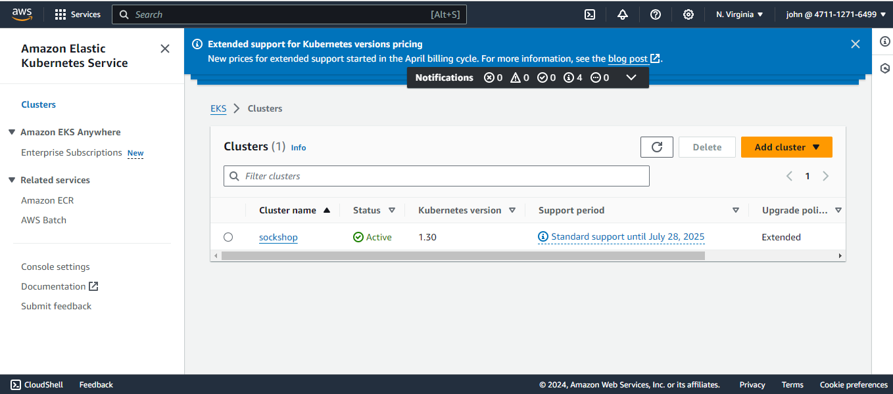
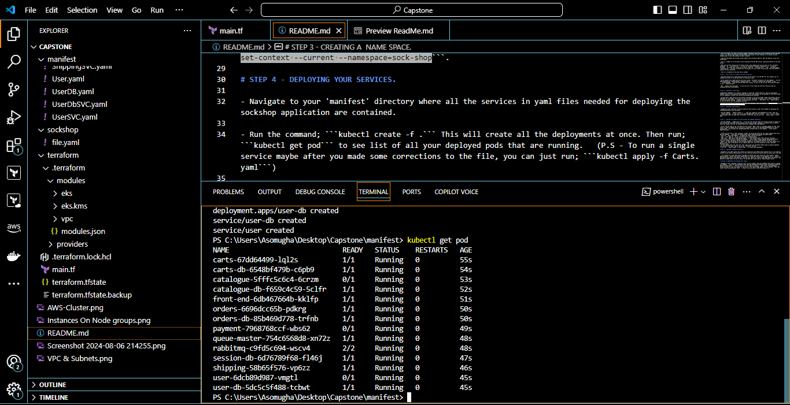
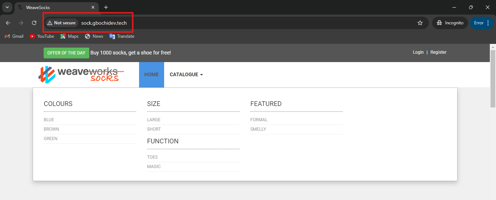

# STEP 1 - CREATE A CLUSTER USING AWS EKS

- The first steps is to open a directory tagged 'terraform' where you will be creating your VPC and EKS Cluster. You should have already configured your AWS account to your terminal so it allows you easy communication to your AWS console via your terminal.

- Copy the VPC Module and the EKS cluster module from Terraform registry. Edit the details to your own preferences. 

- This is a sample of my terraform script creating my VPC and EKS Cluster containing therein my two node groups.

- When you are done writing your terraform script; while making sure you are still in the 'terraform' directory, run ```terraform init``` in order to initialize terraform. Afterwards run ```terraform validate``` to ensure your script has no errors. Then run ```terraform plan```. Run ```terraform apply --auto-approve``` and give it around 10 to 15 minutes for your cluster to provision. Mine took about 12 minutes to fully provision. 

- This is a screenshot of my mine fully created!




# STEP 2 - Next steps is to update the kube config file. 

- The kube config file is what gives you access to the cluster from the AWS CLI. This enables you run commands from the cli to the API server of the master node. (make sure you have your kubernetes intalled on your OS. See Kubernetes documentations or ChatGPT on how to do that).

- So to achieve this, make sure you are still in your 'terraform' directory. Run the command; ```aws eks update-kubeconfig --name=sockshop --region=us-east-1```. Ensure to replace the 'sockshop' in the ```--name=sockshop``` with the name you gave your cluster, as well as you set your own preferred region in the ```region=us-east-1```. 

- Run ```kubectl describe nodes``` to see the list of your nodes and how much resources they are consuming and their performances. 


# STEP 3 - CREATING A  NAME SPACE.

A Kubernetes namespaces is a logical isolation of resources, network policies, rbac and everything. Example; there are two projects using same K8s cluster. One project can use namespace 1 and other project can use namespace 2 without any overlap and authentication problems.

- We have been a name sapce for this project contained in the files already cloned from GitHub. And the namespace is 'sock-shop'. Ensure you are still in the 'terraform' directory. So to create a namespace, run the following command; ```kubectl create namespace sock-shop```. Afterwards, run ```kubectl get ns``` to see the list of all the namespaces you have. 

- Switch from the default namespace to the sock-shop namespace. Run the command; ```kubectl config set-context --current --namespace=sock-shop```. 

# STEP 4 - DEPLOYING YOUR SERVICES.

- Navigate to your 'manifest' directory where all the services in yaml files needed for deploying the sockshop application are contained. 

- Run the command; ```kubectl create -f .``` This will create all the deployments at once. Then run; ```kubectl get pod``` to see list of all your deployed pods that are running.   (P.S - To run a single service maybe after you made some corrections to the file, you can just run; ```kubectl apply -f Carts.yaml```)




# STEP 5 - WRITING THE INGRESS FILE AND SETTING THE INGRESS CONTROLLER.

- Run the command; ```kubectl get svc``` to see all your services that are running. We want to expose to the internet the front-end service amongst the services already  deployed. To achieve this we need to write our ingress file for our ingress controller. Nodeport and Load balancer.

- First find the repo to use. But make sure you install 'HELM'. Helm is a package manager for K8s. Helm charts is used to manage lots of services or resources. Look out for the Helm documentation on how to install Helm.  You can open your gitbash/powershell terminal and run the command; ```choco install kubernetes-helm```.


- Ensure you are still in your 'manifest' folder. Go online and check for the 'nginx ingress helm chart'. Run the command; ```helm repo add ingress-nginx https://kubernetes.github.io/ingress-nginx```
- Then run ```helm repo update``` to update the repo. And you are set!!!  
- Then ```helm repo ls``` to see the repo name as ingress-nginx.  
- Then run; ```helm search repo ingress-nginx``` to see the particular chart you will be using. 
- Then install the chart by running the command; ```helm install ingress ingress-nginx/ingress-nginx```. This will install the nginx ingress controller as well as create a Load balancer in AWS for you.


- When it is done installing, on your terminal interface is an example of how to write your ingress file given to you. Copy it and paste in your ingress.yaml file. This file should be in your 'manifest' directory also.
- In the ingress.yaml file, edit the name, namespace, 'host' tag to your own customized domain name e.g gbochidev.tech And also the ' service name' tag is set to the 'front-end' service. This is a sample;
```
apiVersion: networking.k8s.io/v1
kind: Ingress
metadata:
  name: sockshop-ingress
  namespace: sock-shop
spec:
  ingressClassName: nginx
  rules:
    - host: sock.gbochi.engineer
      http:
        paths:
          - pathType: Prefix
            path: /
            backend:
              service:
                name: front-end
                port:
                  number: 80
              
    # # This section is only required if TLS is to be enabled for the Ingress
    # tls:
    #   - hosts:
    #     - www.example.com
    #     secretName: example-tls
```

- Then run; ```kubectl apply -f ingress.yaml``` to create your deployment. 

# STEP 6 - CREATING A RECORD ON ROUTE 53

- Navigate to your AWS console and create a hosted zone for your domain name on Route 53.
- Then create an A record for your domain name on Route 53 so it can redirect traffic to your domain name and push it to the front-end service so you are able to access your front end.


-  Now, on your browser, key in 'sock.gbochidev.tech', to access the front end of your application. But you need to remove the 's' in the https in the browser to be able to be able to access it because you dont have a TLS certificate yet. 



# STEP 7 - SETTING UP PROMETHEUS AND GRAFANA HELM CHARTS

- Navigate to your 'manifest' directory still on your terminal. Add the prometheus helm chart by running the command; ```helm repo add prometheus-community https://prometheus-community.github.io/helm-charts```. See the list of all the repos by running; ```helm search repo prometheus```. Incase you want to view the content of any chart in the repo already added, run the command; "helm show values 'paste the particular chart'  >> open a file you want to view the contents in" 

- To install the prometheus chart that will as well enable grafana and the alert manager; On your 'manifest' directory run ```helm install prometheus prometheus/kube-prometheus-stack```. Run the 'kubectl get pod' to see the prometheus you just installed running as one of your services, also 'kubectl get svc'.

- Update your ingress.yaml file host to be able to access grafana. Grafana is more like the dashboard you will be viewing as the monitoring tool. Add these lines of codes to your ingress file.
```
- host: grafana.gbochidev.tech
      http:
        paths:
          - pathType: Prefix
            path: /
            backend:
              service:
                name: prometheus-grafana
                port:
                  number: 80
```

-  To be able to access prometheus as well, do same. Paste these lines of codes below the grafana host.

```
- host: prometheus.gbochidev.engineer
      http:
        paths:
          - pathType: Prefix
            path: /
            backend:
              service:
                name: prometheus-kube-prometheus-pprometheus
                port:
                  number: 9090
```

- Run 'kubectl apply -f ingress.yaml file' to have your file updated.

- Attach your load balancer in AWS to the two host names you just created. Go your Route 53 and create another A record, and define a simple record with grafana.gbochidev.tech. Do same for the prometheus, prometheus.gbochidev.tech 

- On your browser, paste the url; 'grafana.gbochidev.tech' to see your grafana running. Do same for prometheus.

-When the dashboard of your grafana opens, its going to require to require an email and password. check the value file for these credentials. To see it; run ```helm show values prometheus/kube-prometheus-stack >> prom``` Open the file 'prom', you will see the username as 'admin' and the admin password as 'prom-operator'. Use them to log into the grafana. 
- prometheus is generating the logs. How do grafana get the logs or data? Switch to your grafana, navigate to the 'Data sources' tab. Click on 'add a new data source' and select 'prometheus'. Paste the url, ie 'grafana.gbochi.engineer' on the space provided for it. Then 'Save & test'. 


# STEP 8 - DEPLOY LETS ENCRYPT.

- You are currently using a not secured address ie http. You need to secure your connection and secure your website, ie https. You will need to install the certificate issuer and the certificate manager. They usually have their own namespace when you run the configuration file. 

- In your 'manifest' directory, the next step now is to apply for our let's encrypt certificate, and for us to be able to do that we must first install the "cert-manager", we would be using helm to add the jetstack repo, then we can now install the cert-manager and all its dependencies. we would be using these links ```helm repo add jetstack https://charts.jetstack.io --force-update``` and ```kubectl apply -f https://github.com/cert-manager/cert-manager/releases/download/v1.15.2/cert-manager.yaml```. After we apply this , all the dependencies would be installed.


  - Update your ingress.yaml file so it can access the certificate manager and use the certificate. Add these lines of code; 

  ```
   annotations:
    kubernetes.io/ingress.class: nginx
    cert-manager.io/cluster-issuer: letsencrypt-prod

      tls:
        - hosts:
            - prometheus.gbochidev.tech
             - grafana.gbochidev.tech
             - sock.gbochidev.tech
          secretName: tls-secret ```

- Configure how the certificate will obtain the certificate by creating a cluster-issuer yaml file;

```
apiVersion: cert-manager.io/v1
kind: ClusterIssuer
metadata:
  name: letsencrypt-prod
spec:
  acme:
    server: https://acme-v02.api.letsencrypt.org/directory
    email: asomugha2018@gmail.com
    privateKeySecretRef:
      name: johnny-secret
    solvers:
      - http01:
          ingress:
            class: nginx

```

- Create a certificate yaml file too for your website.

```
apiVersion: cert-manager.io/v1
kind: Certificate
metadata:
  name: john-certificate
  namespace: sock-shop
spec:
  secretName: johnny-secret
  issuerRef:
    name: letsencrypt-prod
    kind: ClusterIssuer
  commonName: www.gbochidev.tech
  dnsNames:
  - www.gbochidev.tech
```

- So, after you have created those two files, you will now apply them in this format, first you must make sure your main-ingress has been annotated correctly, with your TLS. You will apply your ingress first, ie ```kubectl apply -f ingress.yaml```, followed by the issuer, then the certificate request comes last. Once, you have done that, you can check the status of your certificate using "kubectl get certificate -n sock-shop".


# STEP 9 - CI/CD PIPELINE DEPLOYMENT.

We will be creating two pipelines. One for our infrasture; ie terraform pipeline. The other main pipeline will run 'manifest' files in production. In this project, we will be using Github Actions. 

- Create an S3 bucket and use it as  a backend for the statefile. 


